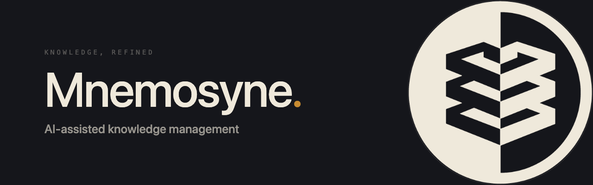

Mnemosyne is an open-source, AI-assisted document ingestion engine. It
classifies source material using the [Diátaxis framework](https://diataxis.fr),
improves its structure and metadata, and opens a pull request for adversarial
review. Two models from different provider families review every contribution.
Unanimously accepted Tier 1 content may merge automatically; disagreement,
reviewer failure, and all Tier 2 governance content require human approval.

The project contains:

- `mnemo-core`: REST API, MCP server, processing and publishing pipeline, audit
  history, and webhook intake.
- `mnemo-ui`: optional static browser interface for previewing, editing, and
  submitting documents.
- `mnemo-curator`: optional inspection and resolution service for Git-backed
  knowledge-base content.
- `mnemo-proxy`: optional edge router providing one public origin for the UI,
  REST API, and MCP endpoint.

> [!WARNING]
> Mnemosyne sends document content to the configured LLM provider. Do not use it
> with sensitive material unless that data transfer is acceptable under your
> security, privacy, and compliance requirements.

## Requirements

- Docker with Docker Compose
- Credentials for Anthropic, OpenAI-compatible APIs (OpenAI, Grok, Gemini, etc.), DeepSeek, or Ollama
- A GitHub token with permission to create branches, files, and pull requests

Branch protection on `main` requires PRs, passing checks, and at least one
approval.

## Installation

Mnemosyne keeps all instance state — configuration and data — in one
directory outside the source tree, located by `MNEMO_HOME` (ADR-017).
Conventionally `~/mnemosyne` on a development machine, `/srv/mnemosyne` on
a Linux server.

```console
git clone https://github.com/pabooth/mnemosyne.git
cd mnemosyne

mkdir -p ~/mnemosyne
cp mnemosyne.env.example ~/mnemosyne/mnemosyne.env
```

Add to your shell profile (and run now):

```console
export MNEMO_HOME="$HOME/mnemosyne"
export COMPOSE_ENV_FILES="$MNEMO_HOME/mnemosyne.env"
```

Then set `MNEMO_API_TOKEN`, `GITHUB_TOKEN`, `GITHUB_REPO`, and your LLM
credentials in `$MNEMO_HOME/mnemosyne.env`.

## Quick start

```console
docker compose --profile ui up --build
```

Open <http://localhost:8888>. Enter `MNEMO_API_TOKEN` under **Settings**.
The token is kept in browser session storage rather than persistent local
storage.

The main interface listens on all host interfaces by default. Set
`MNEMO_UI_BIND_ADDRESS=127.0.0.1` for local-only access, or set it to a
specific host IP address. Direct core and observability ports default to
loopback. See [the Docker deployment guide](docs/deployment/docker-compose.md)
for all host-binding settings.

For the optional telemetry stack:

```console
docker compose --profile observability up --build
```

Without a profile, `docker compose up --build` starts only `mnemo-core` for a
headless deployment. The `ui` profile starts `mnemo-ui` and `mnemo-proxy` in
addition to core.

For the optional curator scan:

```console
docker compose --profile curator run --rm curator
```

Tagged releases publish versioned container images to GHCR, so a deployment
can also pull released images with its own Compose file instead of building
from a checkout.

## API and intake interfaces

| Interface                        | Purpose                                                        |
|----------------------------------|----------------------------------------------------------------|
| `POST /api/v1/process`           | Synchronous preview                                            |
| `POST /api/v1/ingest`            | Synchronous processing and pull request                        |
| `POST /api/v1/publish`           | Publish an edited, reviewed preview without rerunning the LLM  |
| `POST /api/v1/jobs`              | Durable asynchronous process or ingest job                     |
| `POST /api/v1/jobs/batch`        | Batch submission                                               |
| `GET /api/v1/jobs`               | List durable jobs visible to the caller                        |
| `GET /api/v1/jobs/{job_id}`      | Read a durable job result                                      |
| `DELETE /api/v1/jobs/{job_id}`   | Cancel a running durable job                                   |
| `GET /api/v1/audit`              | Admin-only job audit trail                                     |
| `POST /api/v1/sources/file`      | Markdown or text upload                                        |
| `POST /api/v1/sources/url`       | Allow-listed URL intake                                        |
| `POST /api/v1/sources/github`    | File intake from the configured GitHub repository              |
| `POST /api/v1/webhooks/github`   | Signed GitHub push webhook                                     |
| `POST /api/v1/index/trigger`     | On-demand embed-and-write of specific paths (ADR-014)          |
| `POST /api/v1/index/reconcile`   | Full repo/Vector-DB reconciliation pass (ADR-014)              |
| `/mcp/sse`                       | MCP intake server                                              |

The REST API is versioned by URI path (ADR-013); `/health` and `/ready` are
the only unversioned routes. Bearer-token routes require
`Authorization: Bearer <token>`. GitHub webhooks are also under `/api/v1`,
but authenticate with `X-Hub-Signature-256` instead of the bearer token.

## Providers

Set `MAIN_LLM_PROVIDER` to one of:

- `anthropic`
- `openai`
- `deepseek`
- `xai`
- `gemini`
- `ollama`

OpenAI-compatible endpoints can be selected using `OPENAI_BASE_URL`. Provider
credentials and endpoints are configured once, while `MAIN_LLM_MODEL` selects
the model used by the processing pipeline. Operational settings are documented in
[configuration.md](docs/configuration.md).

Adversarial review is off by default. Set `ADVERSARIAL_REVIEW_ENABLED=true` to
enable it, then configure `REVIEWER_CRITIC_PROVIDER`/`MODEL` and
`REVIEWER_JUDGE_PROVIDER`/`MODEL`. The main LLM authors the document and its
acceptance case; the critic challenges that case and the judge adjudicates it.
All three providers must name different families. Each slot reuses the
corresponding provider credentials. See
[configuration.md](docs/configuration.md#adversarial-adjudication-adr-020) for the
full setup and fallback behaviour.

## Governance and safety

- Generated content can only be published to a feature branch and pull request.
- When enabled, every published contribution receives cross-family adversarial
  adjudication. Only a Tier 1 judge decision of `accept` can trigger an
  automatic squash merge; when disabled, or for Tier 2, rejection, uncertainty,
  or unavailable models, contributions remain human-gated.
- Preview output can be edited and then submitted verbatim through
  `/api/v1/publish`.
- Inputs and generated outputs are validated and size-limited.
- Requests have configurable rate, concurrency, and timeout limits.
- Named API tokens support `submitter` and `admin` roles.
- Jobs and mutating API operations are recorded in SQLite.
- URL ingestion is disabled until an explicit hostname allow-list is set.
- Knowledge-base inspection and resolution runs in `mnemo-curator`; fixes are
  submitted back through `mnemo-core` and still become pull requests.
- The optional read-path dedup check (`DEDUP_ENABLED`) never blocks
  processing; likely-duplicate matches are surfaced in the PR body for the
  human reviewer to weigh.

Repository rules and CODEOWNERS must require human approval for Tier 2 paths.
The service account needs permission to comment on PRs and merge eligible Tier 1
PRs, but those repository rules must prevent it from bypassing Tier 2 approval.

## Development

```console
cd mnemo-core
python -m venv .venv
.venv/bin/pip install -e ".[dev]"
.venv/bin/pytest

cd ../mnemo-ui
npm install
npm test
npm run build

cd ../mnemo-curator
python -m venv .venv
.venv/bin/pip install -e ".[dev]"
.venv/bin/pytest -q

cd ../mnemo-proxy
docker build -t mnemo-proxy:local .
```

See [CONTRIBUTING.md](CONTRIBUTING.md), [SECURITY.md](SECURITY.md), and
[ARCHITECTURE.md](docs/ARCHITECTURE.md). Support expectations are documented in
[SUPPORT.md](SUPPORT.md).

## License

MIT © 2026 Paul Booth. See [LICENSE](LICENSE).
