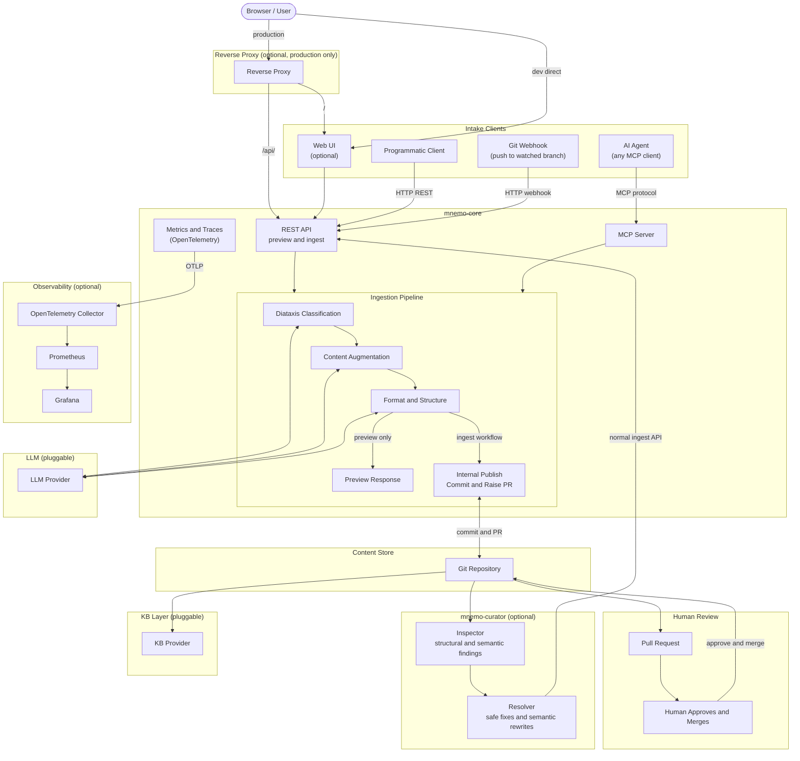

# Architecture

Mnemosyne (mnemo) is an AI-assisted document ingestion engine. It accepts raw documents from multiple intake sources, classifies and augments them using a pluggable LLM, and raises pull requests for human review before content is committed to a knowledge base.

Mnemosyne is not a knowledge base. It is the pipeline that feeds one.

***

## System Overview



***

## Components

### mnemo-core

The core ingestion engine. Exposes two intake interfaces — a REST API and an MCP server — both of which feed the same processing pipeline. Can be deployed and operated independently of the web UI.

The REST API is versioned by URI path (ADR-013). Each version is a
self-contained router package (`mnemo_core/api/v1/`) mounted under its own
prefix; once superseded, a version is frozen except for bug fixes. `/health`
and `/ready` stay unversioned at the app root so infrastructure probes are
not tied to a content API version.

The v1 API supports synchronous and durable asynchronous workflow shapes:

- `POST /api/v1/process` accepts a raw document and returns a processed preview. It does not write to GitHub and does not raise a pull request.
- `POST /api/v1/ingest` accepts a raw document, processes it, commits the processed output to a branch, and raises a pull request for human review.
- `POST /api/v1/publish` accepts an edited `ProcessedDocument` and publishes that exact reviewed output without another LLM call.
- `POST /api/v1/jobs` and `/api/v1/jobs/batch` create durable jobs whose status and results are stored in SQLite; `GET /api/v1/jobs`, `GET /api/v1/jobs/{job_id}`, and `DELETE /api/v1/jobs/{job_id}` expose listing, result lookup, and cancellation.
- `GET /api/v1/audit` exposes the admin-only durable job audit trail.
- `POST /api/v1/sources/file`, `POST /api/v1/sources/url`, and `POST /api/v1/sources/github` create durable jobs from uploaded files, allow-listed URLs, or files in the configured GitHub repository.
- `POST /api/v1/webhooks/github` accepts signed GitHub push webhooks and queues ingest jobs for changed Markdown files on the watched branch.
- `POST /api/v1/index/trigger` and `POST /api/v1/index/reconcile` queue durable indexing jobs: `trigger` embeds specific paths on demand, `reconcile` diffs the full repo against the vector index by content hash and processes only what's missing or changed (ADR-014).

Publishing remains a governed capability of `mnemo-core`. `/api/v1/publish`
exists so a human-edited preview can be committed exactly as reviewed; it
still creates only a feature branch and pull request.

### mnemo-ui

An optional framework-free static web frontend for document submission,
preview editing, job history, and pipeline status. It communicates with
mnemo-core through the REST API. In production, both are fronted by a reverse
proxy.

### mnemo-curator

An optional knowledge-base curation service. It contains two internal
components:

- Inspector scans Git-backed Markdown content for structural findings such as
  missing owners, stale review dates, invalid review dates, duplicate titles,
  and broken relative links, plus semantic quality gaps such as placeholders
  or empty sections.
- Resolver records each finding through the configured issue tracker
  (GitHub, Jira, or SQLite), applies safe structural fixes deterministically,
  optionally uses an OpenAI-compatible model for semantic rewrites, and
  submits corrected content back through `mnemo-core`'s normal
  `/api/v1/ingest` route.

`mnemo-curator` is a separate deployable from `mnemo-core`. It does not bypass
the governed publishing path; all fixes still become pull requests through
core.

### Ingestion Pipeline

The pipeline has a shared processing path and two outcomes:

1. **Diataxis Classification** — the document is classified into one of four Diataxis content types: tutorial, how-to, reference, or explanation. This step uses the LLM.
2. **Content Augmentation** — metadata, frontmatter, summaries, and tags are generated and applied. This step uses the LLM.
3. **Format and Structure** — the document is structured according to the target KB's conventions. This step uses the LLM.

After processing, the caller either receives a preview response or the ingest workflow continues to the internal publish step:

```text
Raw document -> process -> preview response

Raw document -> process -> internal publish -> branch + PR -> human review -> merge
```

The internal publish step commits the processed document to the Git content store and raises a pull request for human review. It is not a separately exposed intake method.

`mnemo-core` separates pure document-processing logic from external side effects. LLM access and publishing are injected into the pipeline runner, allowing REST, MCP, and tests to share the same processing path while substituting fake providers in tests.

### LLM Layer

Pluggable. The reference implementation uses Anthropic's API. Alternative providers can be configured via environment variable. See ADR-004.

### Content Store

A Git repository. All KB content is stored as markdown files under version control. The ingest workflow commits processed documents to feature branches and raises pull requests; it never merges directly.

### KB Layer

Pluggable. Any tool that can serve markdown files from a Git repository can act as the KB layer. The reference implementation is MkDocs Material. See ADR-007 for supported options including SharePoint for enterprise deployments.

### Human Review

Every document submitted through the ingest workflow results in a pull request. A human must review and merge it. The pipeline has no merge permissions. This is a hard governance requirement, not a default setting. See ADR-005.

Preview-only processing is allowed as a non-mutating workflow for user interfaces and internal tooling. Preview output does not reach the KB unless it is later submitted through the governed ingest workflow.

### Reverse Proxy

Optional. Not required for local development. In production, a reverse proxy
sits in front of both mnemo-ui and mnemo-core, routing `/` to the UI and
`/api/` and `/mcp/` to core. A reference Nginx configuration is provided in
`/deploy/reverse-proxy/`.

`mnemo-core` is intended to be private rather than directly exposed to the internet. Even so, REST and MCP intake endpoints should require a simple authentication layer so accidental exposure, misrouting, or lateral access does not grant unauthenticated access to LLM processing or PR creation. Bearer-token REST routes use `Authorization: Bearer <token>`; the GitHub webhook route uses `X-Hub-Signature-256` instead.

### Observability

Optional. mnemo-core is instrumented with OpenTelemetry and emits traces,
metrics, and structured JSON logs. A reference collector, Prometheus, and
Grafana stack is provided in `/deploy/observability/`. The OTLP endpoint is
configurable.

***

## Intake Methods

| Method      | Interface  | Use case                                                                 |
| ----------- | ---------- | ------------------------------------------------------------------------ |
| Web UI      | REST API   | Manual document preview and governed submission via browser              |
| AI Agent    | MCP Server | Submission from Claude, ChatGPT, or any MCP-compatible agent             |
| API Client  | REST API   | CI/CD pipelines, scripts, webhooks, CLI                                  |
| Git Webhook | REST API   | Automatic ingestion on push to a watched branch                          |

External intake clients submit raw documents. They may either request a non-mutating processed preview or use the full ingest workflow that creates a pull request.

The MCP server is an intake interface only. It does not expose KB query or retrieval capabilities. `mnemo-core` exposes the authoritative network MCP server directly over SSE at `/mcp/sse`, with client messages posted to `/mcp/messages`. Clients that can connect to remote MCP servers, such as Cursor or other agent runtimes with SSE support, should connect to this endpoint directly. Clients that only support local stdio MCP servers may use a thin bridge process, but that bridge is transport glue only; all ingestion tools and governance remain inside `mnemo-core`. See ADR-006 and ADR-008.

***

## Deployment

Mnemosyne is distributed as:

- Docker images (`mnemo-core` and `mnemo-ui`)
- Python wheel and source distribution for `mnemo-core`
- Release archives for core, UI, and the complete deployment

A `docker-compose.yml` in the root provides a local development environment. Production deployment options are documented in `/docs/deployment/`.

***

## Repo Structure

```typescript
/
├── mnemo-core/        # REST API, MCP server, ingestion pipeline
├── mnemo-ui/          # Framework-free static web frontend
├── mnemo-curator/     # Optional KB inspection and resolution service
├── deploy/
│   ├── reverse-proxy/ # Stub configs: Caddy, nginx, Traefik
│   └── observability/ # Prometheus + Grafana stack
├── docs/
│   ├── ADRs/          # Architecture Decision Records
│   └── deployment/    # Deployment guides
├── docker-compose.yml # Local development
└── LICENSE
```

***

## Architecture Decision Records

Key decisions governing this project are documented as ADRs in `/docs/ADRs/`.

| ADR | Decision                                         | Status   |
| --- | ------------------------------------------------ | -------- |
| 001 | Monorepo with separate build artefacts           | Accepted |
| 002 | MIT License                                      | Accepted |
| 003 | Diataxis as content taxonomy                     | Accepted |
| 004 | Pluggable LLM layer                              | Accepted |
| 005 | AI must not contribute without human review      | Accepted |
| 006 | MCP as intake interface only, not retrieval      | Accepted |
| 007 | Pluggable KB layer, MkDocs Material as reference | Accepted |
| 008 | MCP transport and client compatibility           | Accepted |
| 009 | Ship mnemo-ui as a standalone static container   | Accepted |
| 010 | Maintain mnemo-ui as source modules, not a monolithic HTML bundle | Accepted |
| 011 | Tiered review model for KB contributions         | Accepted |
| 012 | Container-level decomposition of Mnemosyne       | Accepted |
| 013 | API contract & versioning strategy               | Accepted |
| 014 | Pluggable vector-index layer, sqlite-vec as reference | Accepted |
