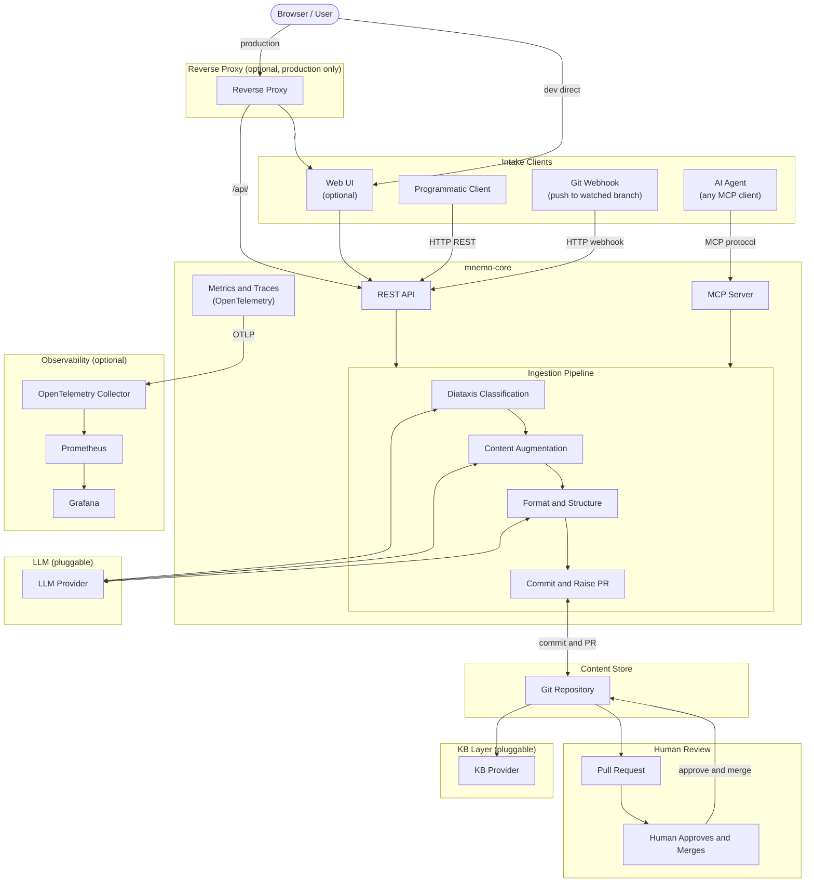

# Architecture

Mnemosyne (mnemo) is an AI-assisted document ingestion engine. It accepts documents from multiple intake sources, classifies and augments them using a pluggable LLM, and raises pull requests for human review before content is committed to a knowledge base.

Mnemosyne is not a knowledge base. It is the pipeline that feeds one.

***

## System Overview



***

## Components

### mnemo-core

The core ingestion engine. Exposes two interfaces — a REST API and an MCP server — both of which feed the same ingestion pipeline. Can be deployed and operated independently of the web UI.

### mnemo-ui

An optional web frontend for document submission and pipeline status. Communicates directly with mnemo-core via the REST API. In production, both are fronted by a reverse proxy.

### Ingestion Pipeline

The pipeline runs sequentially on every submitted document:

1. **Diataxis Classification** — the document is classified into one of four Diataxis content types: tutorial, how-to, reference, or explanation. This step uses the LLM.
2. **Content Augmentation** — metadata, frontmatter, summaries, and tags are generated and applied. This step uses the LLM.
3. **Format and Structure** — the document is structured according to the target KB's conventions. This step uses the LLM.
4. **Commit and Raise PR** — the processed document is committed to the Git content store and a pull request is raised for human review.

### LLM Layer

Pluggable. The reference implementation uses Anthropic's API. Alternative providers can be configured via environment variable. See ADR-004.

### Content Store

A Git repository. All KB content is stored as markdown files under version control. The pipeline commits processed documents and raises pull requests; it never merges directly.

### KB Layer

Pluggable. Any tool that can serve markdown files from a Git repository can act as the KB layer. The reference implementation is MkDocs Material. See ADR-007 for supported options including SharePoint for enterprise deployments.

### Human Review

Every document submitted by the pipeline results in a pull request. A human must review and merge it. The pipeline has no merge permissions. This is a hard governance requirement, not a default setting. See ADR-005.

### Reverse Proxy

Optional. Not required for local development. In production, a reverse proxy sits in front of both mnemo-ui and mnemo-core, routing `/` to the UI and `/api/` to the core. Stub configurations for common options are provided in `/deploy/reverse-proxy/`.

### Observability

Optional. mnemo-core is instrumented with OpenTelemetry and emits traces, metrics, and structured logs. A reference Prometheus and Grafana stack is provided in `/deploy/observability/`. The OTLP endpoint is configurable, allowing export to any compatible backend.

***

## Intake Methods

| Method      | Interface  | Use case                                                     |
| ----------- | ---------- | ------------------------------------------------------------ |
| Web UI      | REST API   | Manual document submission via browser                       |
| AI Agent    | MCP Server | Submission from Claude, ChatGPT, or any MCP-compatible agent |
| API Client  | REST API   | CI/CD pipelines, scripts, webhooks, CLI                      |
| Git Webhook | REST API   | Automatic ingestion on push to a watched branch              |

The MCP server is an intake interface only. It does not expose KB query or retrieval capabilities.

***

## Deployment

Mnemosyne is distributed as:

- Docker images (`mnemo-core`, `mnemo-ui`, `mnemo` combined)
- Release archives (`mnemo-core-x.x.x.tgz`, `mnemo-ui-x.x.x.tgz`, `mnemo-x.x.x.tgz`)

A `docker-compose.yml` in the root provides a local development environment. Production deployment options are documented in `/docs/deployment/`.

***

## Repo Structure

```typescript
/
├── mnemo-core/        # REST API, MCP server, ingestion pipeline
├── mnemo-ui/          # React web frontend
├── deploy/
│   ├── reverse-proxy/ # Stub configs: Caddy, nginx, Traefik
│   └── observability/ # Prometheus + Grafana stack
├── docs/
│   ├── adr/           # Architecture Decision Records
│   └── deployment/    # Deployment guides
├── docker-compose.yml # Local development
└── LICENSE
```

***

## Architecture Decision Records

Key decisions governing this project are documented as ADRs in `/docs/adr/`.

| ADR | Decision                                         | Status   |
| --- | ------------------------------------------------ | -------- |
| 001 | Monorepo with separate build artefacts           | Accepted |
| 002 | MIT License                                      | Accepted |
| 003 | Diataxis as content taxonomy                     | Accepted |
| 004 | Pluggable LLM layer                              | Accepted |
| 005 | AI must not contribute without human review      | Accepted |
| 006 | MCP as intake interface only, not retrieval      | Accepted |
| 007 | Pluggable KB layer, MkDocs Material as reference | Accepted |
